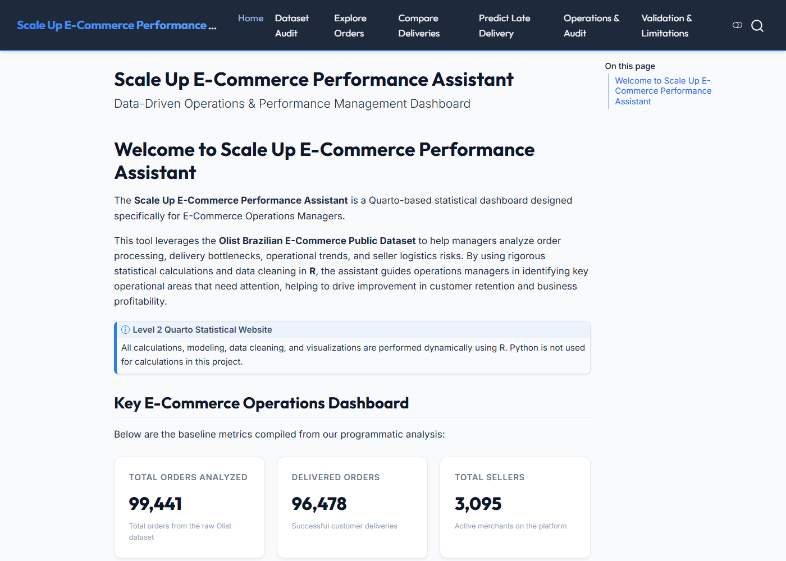

# Scale Up E-Commerce Performance Assistant

## Project Identity

| Field | Detail |
| :--- | :--- |
| **Project Title** | Scale Up E-Commerce Performance Assistant |
| **Student Name** | Laritza Ruz Martinez |
| **Implementation Level** | Level 2 Quarto Statistical Website |
| **Industry** | E-commerce retail |
| **Intended User** | E-commerce operations manager |
| **Main Problem** | Operations managers need a reproducible way to understand order economics, delivery performance, sales trends, seller risk, and data quality across large transaction volumes. |
| **Decision Supported** | Identifying late-delivery patterns, comparing fulfillment structures, screening at-risk orders, reviewing priority sellers, monitoring monthly growth, and validating data before action. |
| **Dataset Source** | [Olist Brazilian E-Commerce Public Dataset](https://www.kaggle.com/datasets/olistbr/brazilian-ecommerce) |

## Current Project Status

The project is **complete and render-ready**:

- Processed datasets validated in `data/processed/`
- Six R analysis scripts implemented and tested
- Six Quarto skill pages integrated
- Six `SKILL.md` agent instruction files completed
- Validation and limitations page completed
- Final report QMD completed
- Website renders to `_site/index.html`

The reviews dataset was **not available**, and simulated review scores were **rejected**. Skill 3 was redesigned around real late-delivery modeling.

---

## Six-Skill Summary Table

| Skill | User Question | Method | Main Output | Decision Supported |
| :--- | :--- | :--- | :--- | :--- |
| Explore Order Performance | What do order value, freight, delivery time, and late-delivery patterns look like? | Descriptive statistics and distribution plots | Summary tables, payment/freight/delivery metrics, histograms | Baseline SLAs and typical order benchmarks |
| Compare Single-Seller and Multi-Seller Orders | Do multi-seller orders take longer to deliver than single-seller orders? | Wilcoxon rank-sum test on delivery days | Group medians, location shift, CI, p-value, boxplot | Fulfillment complexity review |
| Predict Late Delivery | Which order characteristics are associated with late delivery? | Logistic regression with training-only threshold selection | Confusion matrix, ROC AUC, odds ratios, risk probabilities | Late-delivery risk screening |
| Monthly Sales Trend Analysis | How did monthly completed-order volume and payment value change over time? | Monthly aggregation and month-over-month percentages | Trend tables and monthly order/payment plots | Staffing and revenue planning |
| Seller Prioritization | Which sellers should be reviewed first? | Weighted normalized risk score | Ranked seller table and prioritization plot | Seller audit prioritization |
| Data Quality Audit | Are missing values, duplicates, or inconsistent records affecting analysis? | Programmatic validation rules and severity classification | Issue summary tables and audit visualization | Deciding whether the data is reliable enough for reporting |

---

## Three Additional Skills Planning Table

| Skill | User Question | Intended User | Decision Supported | Required Inputs | Method | Output | Validation | Limitation |
| :--- | :--- | :--- | :--- | :--- | :--- | :--- | :--- | :--- |
| Monthly Sales Trend Analysis | How did monthly completed-order volume and total payment value change over time? | E-commerce operations manager | Staffing and revenue planning | `data/processed/order_level_analysis.rds`; completed orders with valid `purchase_month` and nonnegative payment values | Monthly aggregation and month-over-month percentage changes; exclude incomplete boundary months from headline comparisons | Monthly summary tables, key-month metrics, order and payment trend plots | Required variables checked; no duplicate month rows; MoM calculations avoid division by zero | Incomplete months (`2016-09`, `2016-12`) and missing `2016-11` must be annotated; limited historical window prevents full seasonality proof |
| Seller Prioritization | Which sellers should an operations manager review first based on delivery performance and the number of orders affected? | E-commerce operations manager | Seller audit prioritization | `data/processed/seller_order_analysis.rds`; minimum 20 seller-order records and 20 valid delivered orders per seller | Weighted normalized risk score using late-delivery rate, cancellation/unavailable rate, positive median delay, and order-volume exposure | Ranked seller table, component table, eligibility summary, top-10 prioritization plot | Unique seller-order keys; eligibility thresholds enforced; rates between 0 and 1; no duplicate seller rows | Delivery outcomes are order-level and may be shared across sellers in multi-seller orders |
| Data Quality Audit | Are missing values, duplicate keys, invalid dates, inconsistent records, or unusual values affecting analysis reliability? | E-commerce operations manager | Deciding whether the data is reliable enough for reporting | Processed order-level and seller-order datasets; raw Olist CSV files in `data/raw/` when source verification is needed | Programmatic audit rules with Information, Warning, and High severity classification | Issue summary tables, duplicate-key checks, audit visualization, structured CSV summaries | Processed duplicate keys blocked; percentages finite; datasets not modified during audit | Detects structural and logical problems but cannot verify real-world delivery accuracy or payment-adjustment business rules |

---

## Screenshot

Website home page after rendering:



---

## Required Software

- **R** 4.6.0 or compatible
- **Quarto CLI** 1.9.38 or compatible
- A modern web browser for viewing the rendered website
- **Optional for PDF report:** LaTeX distribution such as TinyTeX for `report/final_report.pdf`

> **Optional troubleshooting:** If `quarto` is not on your PATH, use the full executable path from your local Quarto installation (for example, a course-provided Quarto binary on Windows).

## Required R Packages

Analysis scripts use **base R** for reproducibility (`stats`, `graphics`, `grDevices`, `utils`).

Quarto rendering requires:

- `knitr`
- `rmarkdown`

Install if needed:

```r
install.packages(c("knitr", "rmarkdown"))
```

---

## How to Render and View the Website

From the project root:

```bash
# Render the full website
quarto render

# Preview locally
quarto preview
```

Open:

- Website: `_site/index.html`
- Final report HTML fallback: `report/final_report.html`
- Final report PDF: `report/final_report.pdf`

## Render the Final Report

```bash
quarto render report/final_report.qmd
```

---

## Data Access Note

Large raw and processed data files are **not required in Git** when clear access instructions are provided. Download the [Olist Brazilian E-Commerce Public Dataset](https://www.kaggle.com/datasets/olistbr/brazilian-ecommerce) into `data/raw/`, then run:

```r
source("R/import_data.R")
source("R/clean_data.R")
```

This recreates the processed analytical files used by all six skills.

---

## GitHub Repository Instructions

This assignment requires **at least six meaningful commits** with logical staging. A single final commit is **not sufficient**.

### Required repository contents

- The rendered Level 2 website in `_site/` (including all rendered pages)
- `report/final_report.pdf`
- All Quarto source pages, R scripts, and six `SKILL.md` files
- Large raw/processed data may be omitted when this README provides data-access instructions

### Example commit stages for this project

1. **Create R and Quarto project structure** — `.gitignore`, `_quarto.yml`, `styles.css`
2. **Add Olist data preparation and validation pipeline** — `R/import_data.R`, `R/clean_data.R`, `R/validation_helpers.R`
3. **Implement Explore and Compare statistical skills** — explore/compare R scripts, QMD pages, and skill folders
4. **Add late-delivery logistic regression model** — model R script, `model.qmd`, `skills/model/`
5. **Add monthly trend and seller prioritization skills** — trend/seller R scripts and skill folders
6. **Add data quality audit and validation demonstrations** — audit R script, `validation-limitations.qmd`, audit skill folder
7. **Build Level 2 Quarto website** — homepage and operations pages, website helpers, images, rendered `_site/`
8. **Add README, final report, and planning documentation** — `README.md`, `report/final_report.qmd`, PDF, HTML

### Connect and push

```bash
git init
git branch -M main
git remote add origin https://github.com/Laritza-Ruz/CAP3330_Final-Project.git
git push -u origin main
```

Replace the remote URL if you use a different GitHub account or repository name.

## Main Limitations

1. **Missing reviews dataset:** Customer satisfaction could not be modeled from review scores.
2. **Observational data:** All statistical results are associative, not causal.
3. **Shared delivery outcomes:** Multi-seller orders assign the same order-level delivery result to each seller-order record.
4. **Class imbalance:** Late deliveries are uncommon, so model accuracy alone is misleading and precision is low.
5. **Historical window:** Trend analysis covers a limited 2016–2018 period with incomplete boundary months.

---

## How Google Antigravity and Agent Skills Were Used

Google Antigravity helped me with the **initial scaffolding** only. I also used Cursor and other coding agents during later work, but I reviewed the results at each step. The examples below describe the **initial Antigravity phase** honestly.

### Example 1 — Initial R and Quarto Project Structure

- **Request given:** Create a Level 2 Quarto statistical website project for an e-commerce operations assistant using R only.
- **Skill or task involved:** Project scaffolding and repository organization.
- **File created or changed:** `_quarto.yml`, `index.qmd`, initial page scaffolds, `R/` script placeholders, `styles.css`.
- **What I reviewed:** Folder layout, page names, and whether the site structure matched the six required skills.
- **What I corrected, accepted, or rejected:** I accepted the overall structure and later renamed Skill 3 from review prediction to late-delivery modeling after I confirmed the reviews file was missing.

### Example 2 — Initial Dataset Audit and Join-Risk Identification

- **Request given:** Inspect the Olist CSV files and identify table grain, missing files, and join-inflation risks before analysis.
- **Skill or task involved:** Dataset audit and data-preparation planning.
- **File created or changed:** `dataset.qmd`, initial `R/import_data.R`, initial `R/clean_data.R`, raw-file inventory notes.
- **What I reviewed:** Row counts, one-to-many relationships between orders, items, and payments, and the absence of `olist_order_reviews_dataset.csv`.
- **What I corrected, accepted, or rejected:** I agreed with pre-aggregating items and payments before joining; later I added my own validation checks and corrected the seller-order and order-level outputs.

### Example 3 — Initial SKILL.md and Page Scaffolds

- **Request given:** Create six `SKILL.md` files and matching Quarto page scaffolds for agent-guided development.
- **Skill or task involved:** Agent skill documentation and page templating.
- **File created or changed:** `skills/*/SKILL.md`, `explore.qmd`, `compare.qmd`, `model.qmd`, `additional-skills.qmd`, `validation-limitations.qmd`.
- **What I reviewed:** Whether each skill had the required sections and whether the pages matched the intended business questions.
- **What I corrected, accepted, or rejected:** I rejected simulated review-score work, kept the scaffold format, and verified that later scripts and pages used real results.

### Important Note on Review Data

Antigravity initially scaffolded a low-review prediction skill because the original reference project expected review scores. Once I confirmed the reviews dataset was unavailable, **I rejected review-score simulation** and redesigned the project around **real late-delivery outcomes** from processed order data.
