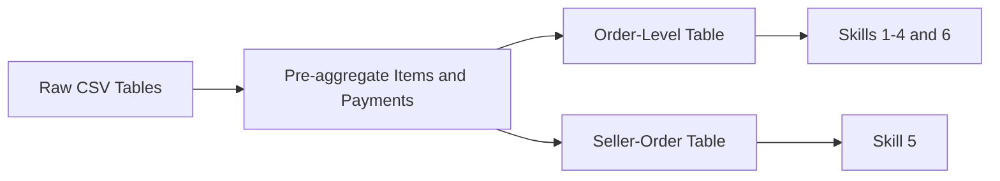

<p class="page-lead">The dashboard uses the Olist Brazilian E-Commerce Public Dataset. Raw CSV files are stored in <code>data/raw/</code> and transformed into two processed analytical tables used by all six skills.</p>

```{r dataset-kpis, echo=FALSE}
source("R/website_helpers.R")
df <- readRDS("data/processed/order_level_analysis.rds")
seller_df <- readRDS("data/processed/seller_order_analysis.rds")
n_sellers <- length(unique(seller_df$seller_id))
```

```{r dataset-kpi-cards, echo=FALSE, results='asis'}
cat(kpi_row(c(
  kpi_card("database", "Source Tables", "6", "Olist CSV files in data/raw/", "blue"),
  kpi_card("cart-check", "Orders", format(nrow(df), big.mark = ","), "Processed order-level rows", "navy"),
  kpi_card("shop", "Sellers", format(n_sellers, big.mark = ","), "Unique merchants", "green"),
  kpi_card("layers", "Processed Analysis Tables", "2", "Order-level and seller-order", "blue")
)))
```

<div class="dash-panel dash-panel-compact">

<div class="panel-header"><span class="panel-icon"><i class="bi bi-table"></i></span> Source Table Summary</div>

<div class="panel-body">

<div class="table-wrap">

| File | Location | Rows |
| :--- | :--- | ---: |
| olist_orders_dataset.csv | data/raw/ | 99,441 |
| olist_customers_dataset.csv | data/raw/ | 99,441 |
| olist_order_items_dataset.csv | data/raw/ | 112,650 |
| olist_order_payments_dataset.csv | data/raw/ | 103,886 |
| olist_products_dataset.csv | data/raw/ | 32,951 |
| olist_sellers_dataset.csv | data/raw/ | 3,095 |

</div>

</div>

</div>

<div class="two-col-grid">

<div class="dash-panel dash-panel-compact">
<div class="panel-header"><span class="panel-icon"><i class="bi bi-bullseye"></i></span> Unit of Observation</div>
<div class="panel-body compact-copy">

- **Order-level table:** one row per `order_id`
- **Seller-order table:** one row per `seller_id` + `order_id`
- Items and payments are aggregated before joining to prevent revenue inflation

</div>
</div>

<div class="dash-panel dash-panel-compact">
<div class="panel-header"><span class="panel-icon"><i class="bi bi-box-seam"></i></span> Processed Datasets</div>
<div class="panel-body compact-copy">

| Dataset | Rows | Use |
| :--- | ---: | :--- |
| order_level_analysis | `r format(nrow(df), big.mark = ",")` | Explore, compare, model, trends |
| seller_order_analysis | `r format(nrow(seller_df), big.mark = ",")` | Seller prioritization |

</div>
</div>

</div>

<div class="dash-panel dash-panel-compact">

<div class="panel-header"><span class="panel-icon"><i class="bi bi-diagram-3"></i></span> Data Workflow</div>

<div class="panel-body mermaid-wrap mermaid-compact">



</div>

</div>

<div class="dash-panel dash-panel-compact">
<div class="panel-header"><span class="panel-icon"><i class="bi bi-clipboard-check"></i></span> Data Quality Notes</div>
<div class="panel-body compact-copy">

- No duplicate processed keys detected
- Missing actual delivery dates affect approximately 2.98% of orders
- Payment totals may differ from item plus freight because of vouchers and adjustments
- Full audit details are on the [Validation](validation-limitations.qmd) page

</div>
</div>

<details class="dash-details">
<summary>Technical join and field details</summary>
<div class="details-body compact-copy">

**Joining strategy:** payments and order items are aggregated to one row per `order_id` before joining to orders.

**Key processed fields:** `total_payment_value`, `total_freight_value`, `actual_delivery_days`, `late_delivery`, `single_seller_order`, `purchase_month`.

**Optional missing files:** product category translation and geolocation data are not used in the six implemented skills.

</div>
</details>
