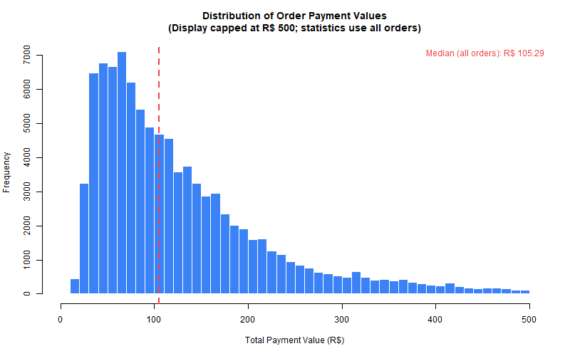
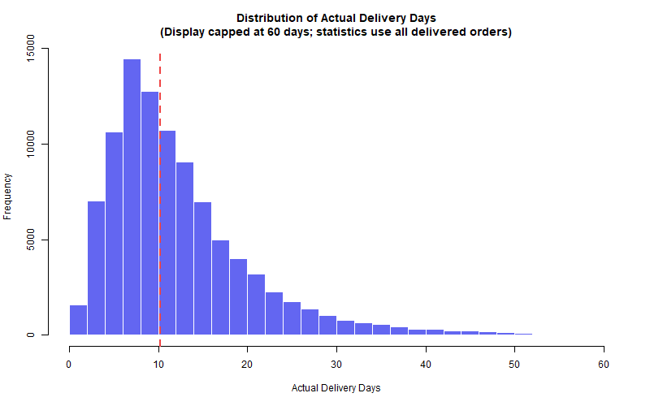
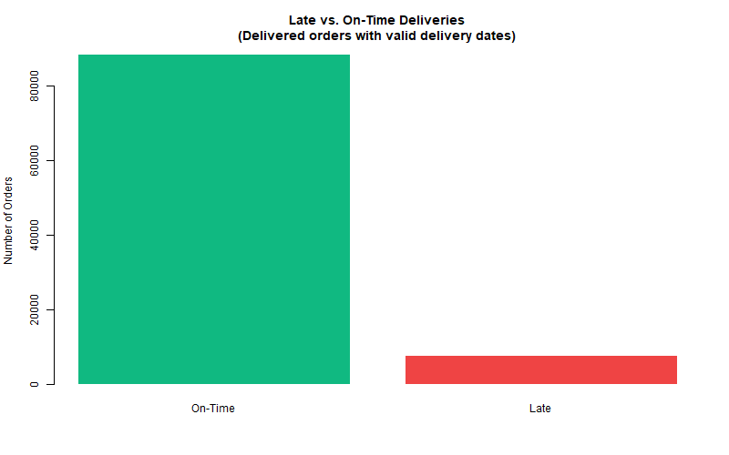

<div class="question-card">
<div class="card-title">Business Question</div>
What do order value, freight cost, delivery time, order status, and late-delivery patterns look like in the Olist order-level dataset?
</div>

```{r explore-setup, echo=FALSE}
source("R/website_helpers.R")
silent_run({
  source("R/explore_orders.R")
  res <- run_explore_orders("data/processed/order_level_analysis.rds")
})
```

```{r explore-kpis, echo=FALSE, results='asis'}
cat(kpi_row(c(
  kpi_card("cart", "Total Orders", format(res$total_orders, big.mark = ","), "All processed orders", "blue"),
  kpi_card("currency-dollar", "Median Payment", paste0("R$ ", sprintf("%.2f", res$median_payment)), "Typical order value", "green"),
  kpi_card("truck", "Median Delivery", paste0(sprintf("%.2f", res$median_delivery_time), " days"), "Completed orders", "navy"),
  kpi_card("clock", "Late-Delivery Rate", sprintf("%.2f%%", 100 * res$late_delivery_rate), "Delivered orders", "orange")
)))
```

```{r explore-summary-cards, echo=FALSE, results='asis'}
cat(sprintf(
  paste0(
    '<div class="three-col-grid summary-mini-grid">',
    '<div class="summary-mini-card"><div class="summary-mini-title">Typical Order Value</div>',
    '<div class="summary-mini-line">Median: R$ %.2f</div>',
    '<div class="summary-mini-line">Mean: R$ %.2f</div></div>',
    '<div class="summary-mini-card"><div class="summary-mini-title">Typical Freight Cost</div>',
    '<div class="summary-mini-line">Median: R$ %.2f</div>',
    '<div class="summary-mini-line">Mean: R$ %.2f</div></div>',
    '<div class="summary-mini-card"><div class="summary-mini-title">Delivery Time</div>',
    '<div class="summary-mini-line">Median: %.2f days</div>',
    '<div class="summary-mini-line">Mean: %.2f days</div></div>',
    '</div>'
  ),
  res$median_payment, res$mean_payment,
  res$median_freight, res$mean_freight,
  res$median_delivery_time, res$mean_delivery_time
))
```

<div class="two-col-grid">

<div class="dash-panel chart-panel">
<div class="panel-header"><span class="panel-icon"><i class="bi bi-bar-chart"></i></span> Payment Distribution</div>
<div class="panel-body"></div>
</div>

<div class="dash-panel chart-panel">
<div class="panel-header"><span class="panel-icon"><i class="bi bi-pie-chart"></i></span> Order Status Mix</div>
<div class="panel-body">

```{r explore-status-chart, echo=FALSE, fig.align="center", fig.height=3.5}
par(mar = c(7, 4, 3, 2))
barplot(
  res$status_table$count,
  names.arg = res$status_table$order_status,
  col = "#2563EB",
  border = NA,
  las = 2,
  main = "Orders by Status",
  ylab = "Count"
)
```

</div>
</div>

<div class="dash-panel chart-panel">
<div class="panel-header"><span class="panel-icon"><i class="bi bi-hourglass-split"></i></span> Delivery Time Distribution</div>
<div class="panel-body"></div>
</div>

<div class="dash-panel chart-panel">
<div class="panel-header"><span class="panel-icon"><i class="bi bi-check2-circle"></i></span> Late vs. On-Time Deliveries</div>
<div class="panel-body"></div>
</div>

</div>

<div class="two-col-grid">

<div class="insight-card">
<div class="card-title">Main Findings</div>

- `r format(res$total_orders, big.mark = ",")` total orders; `r sprintf("%.2f%%", res$completed_pct)` delivered.
- Typical order value is R$ `r sprintf("%.2f", res$median_payment)` (median), above the mean because high-value orders pull the average up.
- Typical freight is R$ `r sprintf("%.2f", res$median_freight)`; median delivery time is `r sprintf("%.2f", res$median_delivery_time)` days.
- Late-delivery rate is `r sprintf("%.2f%%", 100 * res$late_delivery_rate)` among completed orders with valid delivery durations.

</div>

<div class="insight-card">
<div class="card-title">Practical Interpretation</div>
Use medians for customer-facing benchmarks. Track missing delivery dates alongside late deliveries because both affect service reporting quality.
</div>

</div>

<p class="muted-note">Delivery metrics describe successful fulfillment, not the full order lifecycle. Means are inflated by extreme orders.</p>

<details class="dash-details">
<summary>Technical method and validation</summary>
<div class="details-body">

Descriptive statistics are computed from the processed order-level dataset. Required variables are validated before analysis.

```{r explore-missing-table, echo=FALSE}
missing_df <- data.frame(
  Variable = names(res$missing_counts),
  Missing_Count = as.integer(res$missing_counts),
  stringsAsFactors = FALSE
)
knitr::kable(missing_df, align = c("l", "r"), row.names = FALSE)
```

</div>
</details>
