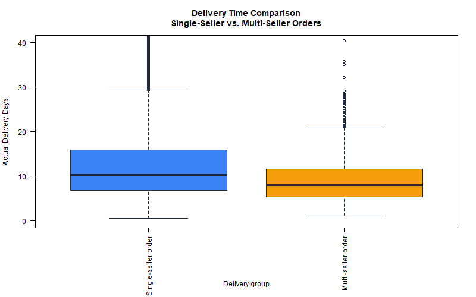
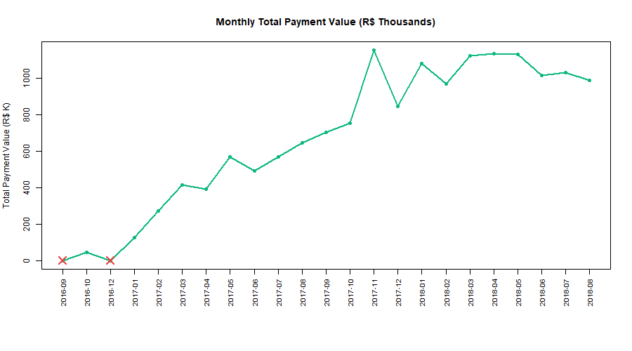
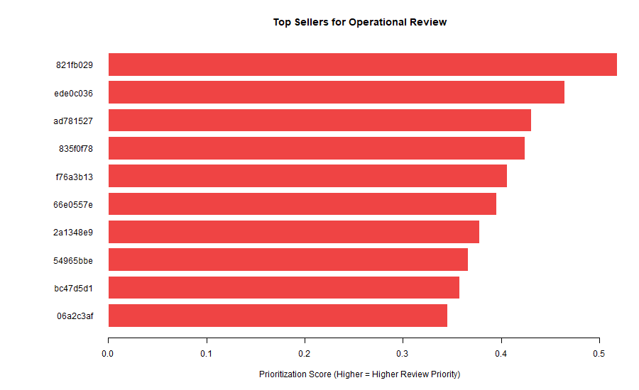

```{r report-setup, include=FALSE}
proj_root <- normalizePath("..")
setwd(proj_root)

source("R/explore_orders.R")
source("R/compare_deliveries.R")
source("R/model_low_reviews.R")
source("R/trend_analysis.R")
source("R/seller_prioritization.R")
source("R/data_quality_audit.R")

exp_res <- run_explore_orders("data/processed/order_level_analysis.rds")
comp_res <- run_compare_deliveries("data/processed/order_level_analysis.rds")
mod_res <- train_predictive_model("data/processed/order_level_analysis.rds")
tr_res <- run_trend_analysis("data/processed/order_level_analysis.rds")
sel_res <- run_seller_prioritization(
  "data/processed/seller_order_analysis.rds",
  min_orders = 20
)
aud_res <- run_data_quality_audit(
  raw_dir = "data/raw",
  processed_path = "data/processed/order_level_analysis.rds"
)

audit_severity <- table(aud_res$issue_summary$severity)
late_prevalence <- exp_res$late_delivery_rate

or_display <- merge(
  mod_res$coefficients[, c("term", "estimate", "p_value")],
  mod_res$odds_ratios[, c("term", "odds_ratio", "or_ci_lower", "or_ci_upper")],
  by = "term"
)
or_display <- or_display[
  !grepl("^purchase_month|^primary_payment_type", or_display$term),
]
or_display <- or_display[order(abs(log(or_display$odds_ratio)), decreasing = TRUE), ]

fmt_pct <- function(x, digits = 2) sprintf(paste0("%.", digits, "f%%"), 100 * x)
fmt_num <- function(x, digits = 2) format(round(x, digits), big.mark = ",", nsmall = digits)
```

# Introduction

Modern e-commerce operations depend on fast, reliable fulfillment across thousands of orders and hundreds of sellers. An **e-commerce operations manager** must monitor payment economics, freight costs, delivery speed, seller risk, and data quality before changing staffing, SLAs, or audit priorities.

The **Scale Up E-Commerce Performance Assistant** addresses this need using a Level 2 Quarto statistical website built entirely in **R**. The tool supports decisions about:

- baseline delivery and payment performance,
- whether multi-seller coordination affects delivery time,
- which orders merit late-delivery screening,
- monthly volume and revenue trends,
- which sellers to review first,
- whether processed data are trustworthy enough for reporting.

The Olist Brazilian E-Commerce Public Dataset provides the empirical foundation. Because the reviews file was unavailable, review-score simulation was rejected and Skill 3 was redesigned around real **late-delivery** outcomes.

# Dataset

The analysis uses six Olist tables joined at the order level after pre-aggregation to prevent revenue inflation from one-to-many relationships between orders, items, and payments.

| Table | Grain | Role |
| :--- | :--- | :--- |
| Orders | One row per order | Status, purchase date, delivery timestamps |
| Customers | One row per customer | Geographic attributes |
| Order items | One row per line item | Price, freight, seller |
| Payments | One row per installment | Payment value and method |
| Products | One row per product | Catalog attributes |
| Sellers | One row per seller | Merchant identifiers |

**Joining strategy:** item and payment tables are aggregated to one row per `order_id` before joining to orders. The processed order-level dataset contains **`r fmt_num(exp_res$total_orders, 0)`** rows; the seller-order dataset contains seller-level records for prioritization.

Key processed fields include `total_payment_value`, `total_freight_value`, `actual_delivery_days`, `late_delivery`, `single_seller_order`, and `purchase_month`. Validation helpers in `R/validation_helpers.R` enforce variable existence, grouping rules, and logical consistency before each skill runs.

# Explore Skill

## Business question

What do order value, freight cost, delivery time, status mix, and late-delivery patterns look like across the platform?

## Method

Descriptive statistics, missing-value counts, status tables, and distribution plots on the processed order-level dataset.

## Results

| Metric | Value |
| :--- | ---: |
| Total orders | `r fmt_num(exp_res$total_orders, 0)` |
| Delivered/completed orders | `r fmt_num(exp_res$completed_orders, 0)` |
| Canceled or unavailable orders | `r fmt_num(exp_res$canceled_or_unavailable_orders, 0)` |
| Missing actual delivery dates | `r fmt_num(exp_res$missing_delivery_dates, 0)` |
| Median payment value | R$ `r fmt_num(exp_res$median_payment, 2)` |
| Median freight value | R$ `r fmt_num(exp_res$median_freight, 2)` |
| Median delivery time (completed) | `r fmt_num(exp_res$median_delivery_time, 2)` days |
| Late deliveries | `r fmt_num(exp_res$late_delivery_count, 0)` |
| Late-delivery rate | `r fmt_pct(exp_res$late_delivery_rate)` |

Payment values are right-skewed: the median (R$ `r fmt_num(exp_res$median_payment, 2)`) is lower than the mean (R$ `r fmt_num(exp_res$mean_payment, 2)`), indicating a long tail of high-value orders. Among completed orders with valid delivery durations, **`r fmt_pct(exp_res$late_delivery_rate)`** arrived after the estimated delivery date.

```{r explore-plot-payment, fig.cap="Distribution of order payment values.", fig.align='center', echo=FALSE}
if (file.exists("../images/order_value_distribution.png")) {
  knitr::include_graphics("../images/order_value_distribution.png")
}
```

```{r explore-plot-late, fig.cap="Late vs. on-time deliveries among completed orders.", fig.align='center', echo=FALSE}
if (file.exists("../images/late_delivery_distribution.png")) {
  knitr::include_graphics("../images/late_delivery_distribution.png")
}
```

## Decision supported

These benchmarks help managers set realistic SLAs, freight expectations, and baseline late-delivery monitoring thresholds.

# Compare Skill

## Business question

Do multi-seller orders take longer to deliver than single-seller orders?

## Method

Completed, non-canceled orders with valid delivery durations were split by `single_seller_order`. Because delivery times are skewed and contain outliers, a **Wilcoxon rank-sum test** was selected (`r comp_res$test_name`). The reported location shift uses the Hodges–Lehmann estimator (multi minus single).

## Results

| Group | N | Median delivery days |
| :--- | ---: | ---: |
| Single-seller | `r fmt_num(comp_res$n_single, 0)` | `r fmt_num(comp_res$median_single, 2)` |
| Multi-seller | `r fmt_num(comp_res$n_multi, 0)` | `r fmt_num(comp_res$median_multi, 2)` |

- **Hodges–Lehmann location shift (multi − single):** `r fmt_num(comp_res$estimated_difference, 2)` days  
- **95% confidence interval:** [`r fmt_num(comp_res$conf_int[1], 2)`, `r fmt_num(comp_res$conf_int[2], 2)`] days  
- **p-value:** `r format(comp_res$p_value, scientific = TRUE, digits = 3)`

```{r compare-plot, fig.cap="Delivery time comparison by seller structure.", fig.align='center', echo=FALSE}
if (file.exists("../images/delivery_comparison_boxplot.png")) {
  
}
```

## Interpretation

Multi-seller orders have a **shorter** median delivery time (`r fmt_num(comp_res$median_multi, 2)` vs. `r fmt_num(comp_res$median_single, 2)` days). The negative location shift (`r fmt_num(comp_res$estimated_difference, 2)` days) is statistically significant, but this is **observational** data. We cannot conclude that adding sellers *causes* faster delivery; unmeasured confounders such as product category, region, or carrier assignment may explain the association. Managers should treat this as a descriptive fulfillment comparison, not proof of coordination efficiency.

# Model Skill

## Business question

Which order characteristics are associated with late delivery among completed orders?

## Method

Logistic regression on **`r fmt_num(mod_res$analysis_sample_size, 0)`** completed orders with valid delivery timestamps and predictors. The data were split **`r fmt_num(mod_res$train_size, 0)`** training / **`r fmt_num(mod_res$test_size, 0)`** test with stratification on `late_delivery`. Late prevalence is **`r fmt_pct(late_prevalence)`**. Because the minority class is rare, the classification threshold was selected on **training data only** using Youden's J: **`r round(mod_res$classification_threshold, 3)`**.

Monetary predictors use **log1p transforms** when skewness exceeds 1. Odds ratios describe multiplicative changes on the log-odds scale; they must **not** be read as one-real changes in raw payment or freight amounts.

## Test-set performance

| Metric | Value |
| :--- | ---: |
| Accuracy | `r fmt_num(mod_res$accuracy, 3)` |
| Sensitivity | `r fmt_num(mod_res$sensitivity, 3)` |
| Specificity | `r fmt_num(mod_res$specificity, 3)` |
| Precision | `r fmt_num(mod_res$precision, 3)` |
| F1 score | `r fmt_num(mod_res$f1_score, 3)` |
| ROC AUC | `r fmt_num(mod_res$roc_auc, 3)` |

```{r model-or-table}
knitr::kable(
  head(or_display, 8),
  col.names = c("Term", "Coefficient", "p-value", "Odds ratio", "OR lower", "OR upper"),
  digits = 4,
  format.args = list(scientific = FALSE)
)
```

## Interpretation

Accuracy near **`r fmt_num(mod_res$accuracy, 3)`** is misleading because predicting the majority on-time class would achieve similar accuracy while catching almost no late orders. Precision is only **`r fmt_num(mod_res$precision, 3)`**, so most flagged orders would still be on time. The model is therefore a **screening tool** for manual review, not an automatic approve/reject rule. ROC AUC of **`r fmt_num(mod_res$roc_auc, 3)`** shows moderate discrimination. All coefficients represent **associations**, not causal effects.

# Monthly Sales Trend Analysis

## Business question

How did monthly completed-order volume and total payment value change from **`r tr_res$date_range[1]`** to **`r tr_res$date_range[2]`**?

## Method

Monthly aggregation of completed orders with valid purchase month and payment value, plus month-over-month percentage changes. Boundary months with partial tracking windows (`r paste(tr_res$incomplete_boundary_months, collapse = ", ")`) and low-volume months are excluded from MoM comparisons.

## Results

- Completed orders analyzed: **`r fmt_num(tr_res$completed_orders_analyzed, 0)`**
- Total payment value: **R$ `r fmt_num(tr_res$total_payment_value_analyzed, 2)`**
- Peak complete month (orders): **`r tr_res$peak_month_count`** — **`r fmt_num(tr_res$peak_count_val, 0)`** orders, R$ **`r fmt_num(tr_res$peak_payment_val, 2)`** payment value
- Largest order-volume increase: **`r tr_res$largest_order_increase_month`** (`r fmt_num(tr_res$largest_order_increase_pct, 1)`% MoM)
- Largest order-volume decrease: **`r tr_res$largest_order_decrease_month`** (`r fmt_num(tr_res$largest_order_decrease_pct, 1)`% MoM)

```{r trend-table}
core_show <- tr_res$core_trends[, c(
  "purchase_month", "completed_order_count",
  "order_count_mom_pct", "total_payment_value", "payment_mom_pct"
)]
knitr::kable(
  core_show,
  col.names = c("Month", "Completed orders", "Orders MoM %", "Payment (R$)", "Payment MoM %"),
  digits = 2,
  format.args = list(big.mark = ",")
)
```

```{r trend-plots, fig.cap="Monthly completed-order volume and payment trends.", out.width="48%", fig.show='hold', fig.align='center', echo=FALSE}
if (file.exists("../output/trend/monthly_order_trend.png")) {
  knitr::include_graphics("../output/trend/monthly_order_trend.png")
}
if (file.exists("../output/trend/monthly_payment_trend.png")) {
  
}
```

## Interpretation

Volume and revenue rose sharply during 2017, with **`r tr_res$peak_month_count`** as the busiest month. November 2017 coincides with Black Friday, which is a plausible operational explanation, but **seasonality is not statistically proven** here. Month **`2016-11`** is missing from the series and should be annotated in any dashboard. Managers can use these trends for staffing and revenue planning while treating boundary months cautiously.

# Seller Prioritization

## Business question

Which sellers should an operations manager review first?

## Method

Of **`r fmt_num(sel_res$total_sellers_analyzed, 0)`** sellers in the processed seller-order table, **`r fmt_num(sel_res$eligible_sellers, 0)`** met eligibility: at least **20 total seller-order records** and **20 valid delivered orders**. A weighted risk score ranks eligible sellers:

`r sel_res$prioritization_formula`

Higher scores indicate higher operational review priority.

## Top 10 priority sellers

```{r seller-table}
top10 <- head(sel_res$ranked_sellers, 10)
seller_display <- data.frame(
  Rank = as.integer(top10$rank),
  `Seller ID` = substr(as.character(top10$seller_id), 1, 8),
  Records = as.integer(top10$seller_order_count),
  `Valid deliveries` = as.integer(top10$valid_delivery_count),
  `Late rate` = round(top10$late_delivery_rate, 3),
  `Cancel rate` = round(top10$canceled_or_unavailable_rate, 3),
  `Priority score` = round(top10$priority_score, 3),
  check.names = FALSE,
  stringsAsFactors = FALSE
)
if (requireNamespace("kableExtra", quietly = TRUE)) {
  knitr::kable(
    seller_display,
    align = c("r", "l", rep("r", 5)),
    row.names = FALSE,
    booktabs = TRUE
  ) |>
    kableExtra::kable_styling(
      latex_options = c("hold_position", "scale_down"),
      font_size = 8,
      full_width = FALSE,
      position = "center"
    )
} else if (knitr::is_latex_output()) {
  knitr::kable(
    seller_display,
    align = c("r", "l", rep("r", 5)),
    row.names = FALSE,
    booktabs = TRUE
  )
} else {
  knitr::kable(
    seller_display,
    align = c("r", "l", rep("r", 5)),
    row.names = FALSE
  )
}
```

```{r seller-table-note, echo=FALSE, results='asis'}
if (knitr::is_latex_output()) {
  cat("\\vspace{0.35em}{\\small Seller IDs are shortened for display; rankings and calculations use the full seller IDs.}\\par\\vspace{1.25em}")
} else {
  cat('<p style="font-size:0.85em;color:#666;margin-top:0.35em;margin-bottom:1.25em;">Seller IDs are shortened for display; rankings and calculations use the full seller IDs.</p>')
}
```

```{r seller-plot, fig.cap="Top seller prioritization scores.", fig.align='center', fig.pos='htbp', echo=FALSE}
if (file.exists("../output/seller/top_seller_priority_plot.png")) {
  
}
```

## Interpretation

The highest-priority seller (`r top10$seller_id[1]`) has a late-delivery rate of **`r fmt_pct(top10$late_delivery_rate[1])`** and priority score **`r fmt_num(top10$priority_score[1], 3)`**. Because delivery outcomes are recorded at the **order level**, multi-seller orders assign the same delivery result to each participating seller. Seller rankings should therefore be interpreted as a prioritization aid, not a definitive blame assignment.

# Data Quality Audit

## Business question

Are missing values, duplicates, inconsistent dates, or payment mismatches affecting analysis?

## Method

Programmatic checks on raw and processed tables with severity labels (High, Warning, Information).

## Summary

- Total issues summarized: **`r nrow(aud_res$issue_summary)`**
- High: **`r audit_severity[["High"]]`**
- Warning: **`r audit_severity[["Warning"]]`**
- Information: **`r audit_severity[["Information"]]`**
- Duplicate processed order keys: **0**
- Missing actual delivery dates: **`r aud_res$issue_summary$issue_count[aud_res$issue_summary$issue_name == "missing_actual_delivery_dates"]`** (~**`r round(aud_res$issue_summary$issue_percentage[aud_res$issue_summary$issue_name == "missing_actual_delivery_dates"], 2)`**% of orders)

```{r audit-high-warning}
audit_hw <- aud_res$issue_summary[
  aud_res$issue_summary$severity %in% c("High", "Warning"),
  c("issue_name", "issue_count", "issue_percentage", "severity")
]
knitr::kable(
  audit_hw,
  col.names = c("Issue", "Count", "Percent", "Severity"),
  digits = 3,
  format.args = list(big.mark = ",")
)
```

Notable findings include **`r aud_res$issue_summary$issue_count[aud_res$issue_summary$issue_name == "orders_without_item_records"]`** orders without item records, **1** order without payment, **8** delivered orders without actual delivery date, **6** canceled/unavailable orders with delivery dates, **4** zero-payment orders, **`r aud_res$issue_summary$issue_count[aud_res$issue_summary$issue_name == "payment_difference_exceeds_tolerance"]`** payment reconciliation differences beyond R$0.05, **`r aud_res$issue_summary$issue_count[aud_res$issue_summary$issue_name == "multi_seller_orders"]`** multi-seller orders, and missing month **2016-11** in the time series.

## Decision supported

Managers should resolve High-severity timestamp and delivered-status issues before trusting delivery KPIs, and treat payment mismatches as review items rather than automatic errors (vouchers and installments may explain differences).

# Google Antigravity and Agent Skills

Google Antigravity helped me create the initial project structure and skill templates. I also used Agent Skills (`SKILL.md` files) to keep each analysis organized. AI tools assisted with drafting, but I reviewed the proposed methods, tested the R scripts, checked the outputs, and made the final decisions about what to keep or change.

| Phase | Request | Output | My review |
| :--- | :--- | :--- | :--- |
| Structure | Create Level 2 Quarto website skeleton | `_quarto.yml`, page scaffolds | I accepted the layout and renamed Skill 3 after confirming the reviews file was missing |
| Data audit | Inspect CSV grains and join risks | `dataset.qmd`, import/clean drafts | I agreed with pre-aggregating one-to-many tables and added my own validation checks |
| Skill scaffolds | Create six `SKILL.md` files | `skills/*/SKILL.md` | I accepted the format but rejected simulated review scores |

**Rejected redesign:** After I confirmed that `olist_order_reviews_dataset.csv` was unavailable, I rejected review-score simulation and rebuilt Skill 3 around real late-delivery outcomes. I also checked methods, outputs, validation wording, and limitations throughout the project.

# Application or Delivery

Operations managers render the website from the project root:

```powershell
& "C:\Scale Up_Project\Original working Scale Up AI Manager\bin\quarto.exe" render
```

The static site is published to `_site/index.html`. The final report renders separately:

```powershell
& "C:\Scale Up_Project\Original working Scale Up AI Manager\bin\quarto.exe" render "final report/final_report.qmd"
```

Each Quarto page documents one skill; processed CSV/RDS outputs in `output/` and `data/processed/` support audit trails. The tool is intended for local or intranet deployment as a website that helps managers review results, not autonomous order routing.

# Limitations

1. **Dataset limitation:** The Olist reviews file is missing, historical coverage ends in 2018, and **`2016-11`** is absent from monthly trends. Approximately **`r fmt_pct(exp_res$missing_delivery_dates / exp_res$total_orders)`** of orders lack actual delivery dates.
2. **Statistical limitation:** All comparisons and regression results are associative. Class imbalance makes accuracy misleading for late-delivery prediction, and seller metrics inherit shared order-level delivery outcomes for multi-seller orders.
3. **Implementation limitation:** Analyses use base R for stability; the website excludes the final report from default site render (`!final report/final_report.qmd` in `_quarto.yml`) to keep PDF compilation separate. Plot regeneration depends on running analysis scripts during report render.

# Reflection

This project taught me that cleaning and joining the Olist tables took more work than I expected at the start. Orders, items, and payments are one-to-many tables, so a simple join would have duplicated payment and freight totals. I had to aggregate items and payments to one row per order before the analysis made sense.

Interpreting the results also required more caution than I first assumed. The multi-seller comparison was statistically significant, but I could not describe it as causal because seller count may relate to order size, distance, or product mix. Class imbalance made the late-delivery model’s accuracy look better than it really was, and the low precision showed me that the model works better as a screening step than as a final decision rule.

I added monthly trend analysis, seller prioritization, and a data quality audit because an operations manager needs more than one chart and one hypothesis test. Trends help with staffing plans, seller ranking helps decide who to review first, and the audit helped me judge whether the processed files were reliable before the results are reported.

With more time, I would add filters by state or product category, test different model thresholds based on business cost, and explore survival models for time-to-delivery instead of only a yes/no late flag.
