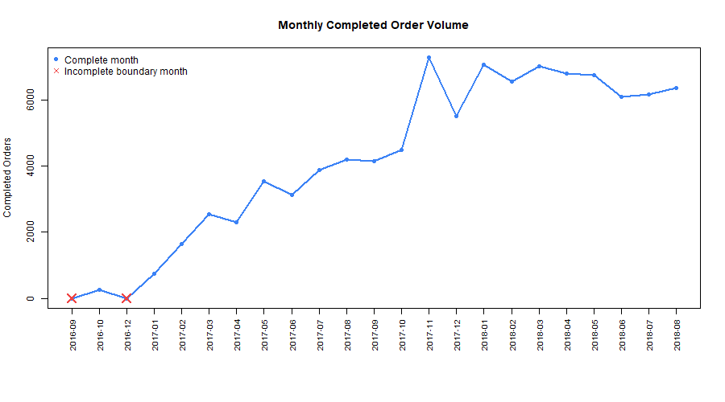

```{r index-setup, echo=FALSE}
source("R/website_helpers.R")
df <- readRDS("data/processed/order_level_analysis.rds")
total_orders <- nrow(df)
delivered_orders <- sum(df$completed_order, na.rm = TRUE)
sellers_raw <- read.csv("data/raw/olist_sellers_dataset.csv", stringsAsFactors = FALSE)
total_sellers <- nrow(sellers_raw)
late_rate <- mean(df$late_delivery[df$completed_order == 1], na.rm = TRUE)
```

```{=html}
<div class="hero-banner">
  <h1>Scale Up E-Commerce Analytics</h1>
  <div class="hero-sub">Operational intelligence for orders, fulfillment, seller performance, and data quality.</div>
  <p class="hero-desc">A reproducible R and Quarto dashboard built on the Olist Brazilian E-Commerce dataset for operations managers who need delivery, revenue, seller-risk, and data-trust insights.</p>
</div>
```

```{r index-kpis, echo=FALSE, results='asis'}
cat(kpi_row(c(
  kpi_card("cart-check", "Total Orders", format(total_orders, big.mark = ","), "Processed order records", "blue"),
  kpi_card("truck", "Delivered Orders", format(delivered_orders, big.mark = ","), "Completed deliveries", "green"),
  kpi_card("shop", "Active Sellers", format(total_sellers, big.mark = ","), "Merchants in catalog", "navy"),
  kpi_card("clock-history", "Late-Delivery Rate", sprintf("%.2f%%", 100 * late_rate), "Among delivered orders", "orange")
)))
```

## Analysis Skills

```{=html}
<div class="skill-tile-grid">

<div class="skill-tile">
  <div class="skill-tile-icon"><i class="bi bi-bar-chart"></i></div>
  <div class="skill-tile-title">Explore Orders</div>
  <div class="skill-tile-desc">Payment, freight, delivery time, and late-delivery distributions.</div>
  <a class="skill-tile-btn" href="explore.html">Open skill</a>
</div>

<div class="skill-tile">
  <div class="skill-tile-icon"><i class="bi bi-arrow-left-right"></i></div>
  <div class="skill-tile-title">Compare Deliveries</div>
  <div class="skill-tile-desc">Single-seller vs. multi-seller delivery time comparison.</div>
  <a class="skill-tile-btn" href="compare.html">Open skill</a>
</div>

<div class="skill-tile">
  <div class="skill-tile-icon"><i class="bi bi-clock-history"></i></div>
  <div class="skill-tile-title">Late Delivery Model</div>
  <div class="skill-tile-desc">Logistic regression for late-delivery risk screening.</div>
  <a class="skill-tile-btn" href="model.html">Open skill</a>
</div>

<div class="skill-tile">
  <div class="skill-tile-icon"><i class="bi bi-graph-up-arrow"></i></div>
  <div class="skill-tile-title">Monthly Trends</div>
  <div class="skill-tile-desc">Completed-order volume and payment value over time.</div>
  <a class="skill-tile-btn" href="additional-skills.html">Open skill</a>
</div>

<div class="skill-tile">
  <div class="skill-tile-icon"><i class="bi bi-person-exclamation"></i></div>
  <div class="skill-tile-title">Seller Prioritization</div>
  <div class="skill-tile-desc">Ranked seller review list based on delivery risk.</div>
  <a class="skill-tile-btn" href="additional-skills.html">Open skill</a>
</div>

<div class="skill-tile">
  <div class="skill-tile-icon"><i class="bi bi-shield-check"></i></div>
  <div class="skill-tile-title">Data Quality Audit</div>
  <div class="skill-tile-desc">Missing values, duplicates, and consistency checks.</div>
  <a class="skill-tile-btn" href="validation-limitations.html">Open skill</a>
</div>

</div>
```

## Operational Preview

<div class="dash-panel chart-panel">

<div class="panel-header"><span class="panel-icon"><i class="bi bi-graph-up"></i></span> Monthly Completed Order Volume</div>

<div class="panel-body">



</div>

</div>

## Intended User & Decision Supported

<div class="info-card">

**Intended user:** E-commerce operations manager responsible for fulfillment, seller performance, and operational reporting.

**Decision supported:** Delivery SLAs, fulfillment structure review, late-delivery screening, staffing and revenue planning, seller audit prioritization, and data-trust validation before reporting.

</div>
