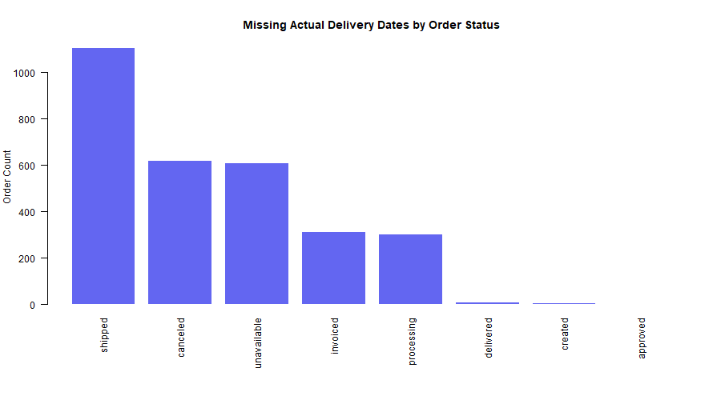

```{r validation-load, echo=FALSE}
source("R/website_helpers.R")
silent_run({
  source("R/validation_helpers.R")
  source("R/data_quality_audit.R")
  audit_res <- run_data_quality_audit()
})
df <- readRDS("data/processed/order_level_analysis.rds")
issues <- audit_res$issue_summary
get_count <- function(name) {
  idx <- which(issues$issue_name == name)
  if (length(idx) == 0) return(0L)
  as.integer(issues$issue_count[idx[1]])
}
problems <- issues[
  issues$issue_count > 0 &
    issues$severity %in% c("High", "Warning") &
    !issues$issue_name %in% c("order_level_rows", "seller_order_rows"),
]
passed_names <- c(
  "duplicate_order_id_processed",
  "duplicate_seller_order_processed",
  "missing_customer_relationship",
  "missing_seller_relationship",
  "negative_item_prices",
  "negative_freight_values",
  "negative_payment_values",
  "missing_purchase_dates",
  "missing_estimated_delivery_dates"
)
passed_labels <- vapply(passed_names, function(name) {
  label <- passed_check_label(name)
  if (get_count(name) == 0) label else NA_character_
}, character(1))
passed_labels <- passed_labels[!is.na(passed_labels)]
if (all(get_count(c(
  "actual_delivery_before_purchase",
  "estimated_delivery_before_purchase",
  "approval_before_purchase"
)) == 0)) {
  passed_labels <- c(passed_labels, "No dates occurring before purchase")
}
dup_keys <- get_count("duplicate_order_id_processed") + get_count("duplicate_seller_order_processed")
```

<div class="question-card">
<div class="card-title">Business Question</div>
Are missing values, duplicate keys, invalid dates, inconsistent records, or unusual values affecting the reliability of the analysis?
</div>

```{r validation-kpis, echo=FALSE, results='asis'}
cat(kpi_row(c(
  kpi_card("clipboard-data", "Programmatic Checks", format(nrow(issues), big.mark = ","), "Automated audit rules", "blue"),
  kpi_card("calendar-x", "Delivered Missing Dates", format(get_count("delivered_without_actual_delivery_date"), big.mark = ","), "Delivered orders without delivery date", "red"),
  kpi_card("exclamation-triangle", "Canceled With Dates", format(get_count("canceled_or_unavailable_with_actual_delivery_date"), big.mark = ","), "Canceled/unavailable with delivery date", "orange"),
  kpi_card("copy", "Duplicate Processed Keys", format(dup_keys, big.mark = ","), "Order and seller-order keys", "green")
)))
```

## Problems Found {.validation-section}

<div class="dash-panel dash-panel-compact">
<div class="panel-body">

```{r validation-problems, echo=FALSE}
if (nrow(problems) == 0) {
  cat('<p class="compact-copy">No active high- or warning-level issues detected.</p>')
} else {
  problem_df <- data.frame(
    Issue = vapply(problems$issue_name, issue_label, character(1)),
    Count = format(problems$issue_count, big.mark = ","),
    stringsAsFactors = FALSE
  )
  knitr::kable(problem_df, align = c("l", "r"), row.names = FALSE)
}
```

</div>
</div>

<div class="dash-panel chart-panel">
<div class="panel-header"><span class="panel-icon"><i class="bi bi-bar-chart"></i></span> Missing Delivery Dates by Status</div>
<div class="panel-body">

```{r missing-delivery-plot, echo=FALSE, fig.cap="Missing actual delivery dates by order status", fig.align="center"}

```

</div>
</div>

## Checks Passed {.validation-section}

<div class="checklist-grid">

```{r validation-passed, echo=FALSE, results='asis'}
mid <- ceiling(length(passed_labels) / 2)
left <- passed_labels[seq_len(mid)]
right <- passed_labels[seq(mid + 1, length(passed_labels))]
cat('<div class="checklist-col"><ul class="checklist">')
for (item in left) cat("<li>", item, "</li>", sep = "")
cat('</ul></div><div class="checklist-col"><ul class="checklist">')
for (item in right) cat("<li>", item, "</li>", sep = "")
cat("</ul></div>")
```

</div>

## Invalid Request Demonstrations {.validation-section}

<details class="dash-details demo-accordion">
<summary>Nonexistent variable</summary>
<div class="details-body compact-copy">
<div class="demo-msg">`r tryCatch(validate_variable_exists(df, "misspelled_payment_column"), error = function(e) e$message)`</div>
</div>
</details>

<details class="dash-details demo-accordion">
<summary>Incorrect variable type</summary>
<div class="details-body compact-copy">
<div class="demo-msg">`r tryCatch(validate_variable_type(df, "customer_city", "numeric"), error = function(e) e$message)`</div>
</div>
</details>

<details class="dash-details demo-accordion">
<summary>More than two groups</summary>
<div class="details-body compact-copy">
<div class="demo-msg">`r tryCatch(validate_two_groups(df, "order_status"), error = function(e) e$message)`</div>
</div>
</details>

<details class="dash-details demo-accordion">
<summary>Missing required date</summary>
<div class="details-body compact-copy">
<div class="demo-msg">`r tryCatch(validate_required_date(data.frame(purchase_date = rep(as.Date(NA), 5)), "purchase_date"), error = function(e) e$message)`</div>
</div>
</details>

<details class="dash-details demo-accordion">
<summary>Missing prediction input</summary>
<div class="details-body compact-copy">
<div class="demo-msg">`r tryCatch(validate_prediction_inputs(c("total_item_price", "seller_count"), data.frame(total_item_price = 100, seller_count = NA)), error = function(e) e$message)`</div>
</div>
</details>

<details class="dash-details demo-accordion">
<summary>Causal conclusion request</summary>
<div class="details-body compact-copy">
<div class="demo-msg">`r tryCatch(validate_no_causal_conclusion("The model proves that higher freight costs cause late deliveries."), error = function(e) e$message)`</div>
</div>
</details>

## Recommendations {.validation-section}

<div class="info-card compact-copy">

1. Resolve delivered orders without delivery dates before reporting delivery KPIs.
2. Annotate missing month 2016-11 and boundary months in trend analysis.
3. Review payment differences above tolerance separately from item-plus-freight totals.
4. Interpret seller delivery metrics cautiously when multi-seller orders share one delivery outcome.

</div>

## Limitations {.validation-section}

<p class="muted-note">Programmatic checks validate structure and logical consistency but cannot detect courier mis-scans or unrecorded customer contacts. Outliers may represent legitimate high-value or long-distance orders.</p>

<details class="dash-details">
<summary>Full Audit Details</summary>
<div class="details-body">

```{r audit-table, echo=FALSE}
audit_display <- data.frame(
  Issue = vapply(issues$issue_name, issue_label, character(1)),
  Count = format(issues$issue_count, big.mark = ","),
  Percent = sprintf("%.2f%%", issues$issue_percentage),
  Severity = issues$severity,
  stringsAsFactors = FALSE
)
knitr::kable(audit_display, align = c("l", "r", "r", "l"), row.names = FALSE)
```

</div>
</details>

<details class="dash-details">
<summary>Duplicate keys, dates, monetary checks, and relationships</summary>
<div class="details-body">

```{r duplicate-table, echo=FALSE}
knitr::kable(audit_res$duplicate_key_summary, col.names = c("Dataset", "Key", "Duplicate Count"), row.names = FALSE)
```

```{r date-table, echo=FALSE}
knitr::kable(audit_res$date_consistency_summary, col.names = c("Check", "Count", "Percent"), digits = 4, row.names = FALSE)
```

```{r monetary-table, echo=FALSE}
knitr::kable(
  audit_res$monetary_quality_summary[, c("check_name", "count", "percentage")],
  col.names = c("Check", "Count", "Percent"),
  digits = 4,
  row.names = FALSE
)
```

```{r relationship-table, echo=FALSE}
knitr::kable(audit_res$relationship_summary, col.names = c("Check", "Count"), digits = 2, row.names = FALSE)
```

</div>
</details>
